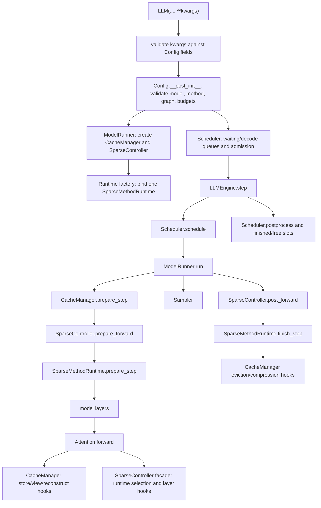

# Sparse-VLLM Control Map

This page maps Sparse-VLLM runtime ownership and control flow. It is not a
benchmark result and should not be cited as evidence for a method claim. Use it
to decide where a change belongs, which docs to trust, and which checks to run
before reporting results.

## Documentation Map

- Start from `docs/en/README.md` when choosing where documentation belongs.
- Stable English runbooks and contracts live under the topical `docs/en/`
  directories.
- Keep local run ledgers out of repo docs. Use the run artifacts themselves
  when a repo-facing claim needs evidence.
- `docs/en/configuration/runtime-parameter-semantics.md` is the canonical parameter contract.
  Keep it synchronized before adding new public run configs.

## One Sentence Model

Sparse-VLLM is a sparse-first inference engine where `Scheduler` decides what
runs, `ModelRunner` executes it, `SparseController` delegates logical method
semantics to a `SparseMethodRuntime`, `Attention` calls generic hooks, and
`CacheManager` implementations own method-specific physical state, allocation,
views, reconstruction, and graph-stable metadata.

For SnapKV, H2O, PyramidKV, R-KV, and SkipKV chain prefix caching,
`ChainCacheIndex` owns logical lifecycle only. `ChainCacheCoordinator` plans
transitions, cache managers retain all payload/metadata, and `RuntimeState`
performs reclamation. The OpenAI dispatcher acknowledges admission before
constructing a stream. Smart-router affinity comes from parallel read-only
worker probes, not a router-owned chain map. Rank 0 retains compact logical
token IDs only to preserve exact BPE identity for text continuations; the
history is capacity-bounded and is not part of the physical KV payload.

## Runtime Flow



## Directory Ownership

| Path | Role | Ownership rule |
| --- | --- | --- |
| `src/sparsevllm/configs/groups.py`, `runtime.py` | Canonical runtime fields, validation, graph constraints, and method-normalized defaults. | Public and internal field names must stay identical; mirror knob behavior in `docs/en/configuration/runtime-parameter-semantics.md`. |
| `src/sparsevllm/method_registry.py` | Sparse method aliases and default prefill policy. | New method strings and policy defaults start here. |
| `src/sparsevllm/engine/llm_engine.py` | Public engine lifecycle, tokenizer, scheduler loop, warmup, throughput logging. | Should not grow method-specific runtime logic. |
| `src/sparsevllm/engine/scheduler.py` | Prefill execution-mode batching, decode long/short separation, prompt admission, preemption. | Uses cache-manager mode and budget hooks instead of knowing method internals. |
| `src/sparsevllm/engine/model_runner.py` | Model load, TP RPC, CUDA graph runners, prepare/run/sample orchestration. | Owns execution mechanics, not token-selection policy. |
| `src/sparsevllm/engine/cache_manager/base.py` | Cache-manager interface and method routing. | Method-specific persistent state belongs behind this interface. |
| `src/sparsevllm/engine/cache_manager/*.py` | Physical/logical KV state for each sparse method. | This is the primary place for persistent physical method implementation. |
| `src/sparsevllm/engine/sparse_controller.py` | Stable method-agnostic lifecycle facade. | Delegate through typed runtime requests/events; do not add method-name hot-path branches. |
| `src/sparsevllm/engine/sparse_methods/` | Runtime ABC/factory, current-step state, score/selection orchestration, cross-layer propagation, and mutation triggers. | Split method mechanics here while keeping persistent physical state in cache managers. |
| `src/sparsevllm/layers/attention.py` | Generic KV store + attention kernel dispatch + hook calls. | Add generic hooks if needed; avoid method-specific branches. |
| `src/sparsevllm/kernels/triton/` | Repository-owned Triton kernels. | Kernel wrappers should fail fast on invalid shape/dtype assumptions. |
| `src/sparsevllm/kernels/tilelang/` | Repository-owned TileLang kernels and runtime bindings. | Keep compilation and launch details out of operators. |
| `src/sparsevllm/kernels/external/` | Thin adapters for third-party kernel libraries. | Keep optional imports lazy and validate supported API versions. |
| `benchmark/model_adapters/sparsevllm.py` | Shared native text-benchmark generation adapter. | Keep it thin; runtime behavior belongs in `src/sparsevllm/`. |
| `benchmark/` and `scripts/` | Evaluation, debugging, analysis, throughput scripts. | Preserve raw outputs, parsed outputs, per-sample status, aggregate metrics, and run info separately. |

## Method Families

| Family | Sparse-VLLM method names | Core behavior | Main files |
| --- | --- | --- | --- |
| Dense | `vanilla` / `""` | Full KV cache, no sparse selection. | `standard.py`, generic attention path |
| Streaming window | `streamingllm`, `attention-sink`, `attention_sink` | Physical eviction to sink + recent tokens. | `streamingllm.py`, `standard.py`-style mechanics |
| SnapKV / PyramidKV | `snapkv`, `pyramidkv` | Physical eviction after score-based keep selection; PyramidKV changes per-layer budgets. | `cache_manager/snapkv.py`, `sparse_methods/snapkv.py` |
| OmniKV | `omnikv` | Logical masking/view building from observation-layer scores. `full_attention_layers=auto` resolves a model profile that may be shared with DeltaKV; unregistered models should be calibrated with `python -m sparsevllm.utils.select_omnikv_full_layers`. | `cache_manager/omnikv.py`, `sparse_methods/dynamic.py`, `omnikv_fused.py` |
| QuEST | `quest` | Query-aware decode page/chunk selection; persistent page metadata and native view construction remain cache-manager/provider owned. | `cache_manager/quest.py`, `sparse_methods/passthrough.py` |
| Query-Robust | `query_robust` | Explicit-KV decode page selection from fixed query-hull landmarks, entropy biases, and certificate radii; page lifecycle remains cache-manager/provider owned. | `cache_manager/query_robust.py`, `kernels/triton/query_robust.py`, `sparse_methods/query_robust.py` |
| DeltaKV | `deltakv` | Compressor-backed hybrid cache: sparse full/reference pool plus compressed latent state. Registered models may share OmniKV's `full_attention_layers=auto` profile. | `cache_manager/deltakv*.py`, `sparse_methods/dynamic.py`, `deltakv_kernels.py` |

## State Ownership Contracts

- `Sequence` owns request-local counters: prompt length, prefilled length,
  current chunk size, generated tokens, and finished status.
- `Scheduler` owns queue membership and admission decisions. It must ask the
  cache manager for costs, budgets, and full-prefill routing.
- `CacheManager` owns physical slots, row maps, full/sparse pools, compressed
  lengths, graph-stable metadata, temporary reconstruction slots, and method
  allocation arithmetic.
- `SparseMethodRuntime` owns per-step, per-layer logical state and cross-layer
  propagation of selected indices. It should not own long-lived cache metadata.
- `SparseController` owns only the stable engine-facing lifecycle and delegates
  logical method behavior through typed runtime requests and events.
- `Attention` owns neither policy nor persistent state. It stores current K/V,
  asks for the read view, runs generic prefill/decode kernels, and invokes
  layer-end hooks.
- CUDA graph runners own graph capture/replay mechanics; cache managers provide
  graph-stable buffers and plan references.

## Where Control Is Currently Hardest

| File | Why it is hard | How to approach it |
| --- | --- | --- |
| `src/sparsevllm/engine/cache_manager/deltakv_less_memory.py` | Very large direct-residual/full-layer-KIVI/static-graph implementation. | Treat as several logical regions: allocation, prefill staging, full-layer KIVI, sparse raw/ref views, static decode plan, reconstruction/writeback. Add tests around the region touched. |
| `src/sparsevllm/engine/cache_manager/deltakv.py` | Compressor-backed V4 path combines clustering, latent storage, full pool, staging, reconstruction, and graph hooks. | Avoid cosmetic edits. Change only with focused native runtime and kernel tests. |
| `src/sparsevllm/engine/sparse_methods/dynamic.py` | OmniKV and DeltaKV share observation-layer scoring but differ in logical selection and physical payload semantics. | Preserve the shared score lifecycle; keep pool/reconstruction ownership in each cache manager. |
| `src/sparsevllm/engine/sparse_methods/snapkv.py` | SnapKV and PyramidKV share scored compaction while using different layer budgets and triggers. | Reuse only the common lifecycle and preserve method-specific boundary behavior. |
| `src/sparsevllm/layers/attention.py` | Small enough, but high blast radius because every method passes through it. | Keep it method-agnostic. Prefer adding a cache-manager hook over adding a branch here. |
## Change Guardrails

Before changing Sparse-VLLM runtime code:

1. Identify the affected native Sparse-vLLM runtime path.
2. Identify the method family and graph mode: eager, decode graph, prefill
   graph, or both.
3. Identify the state owner. Persistent physical/prefix-coupled state belongs
   in a cache manager; current-step/cross-layer logical state belongs in a
   sparse method runtime.
4. Do not use legacy public runtime names in new configs. Use
   `sparse_method`, `deltakv_checkpoint_path`, `decode_keep_tokens`,
   `sink_keep_tokens`, `recent_keep_tokens`, `full_attention_layers`, and
   `engine_prefill_chunk_size`.
5. Sparse-VLLM keep budgets are token counts, not ratios.
6. Any fallback must be explicit and documented. Do not silently ignore bad
   configs, missing checkpoints, missing datasets, failed parses, or failed
   metrics.
7. If adding or refactoring a sparse method, follow the
   [sparse method runtime architecture](sparse-method-runtime.md): generic
   `attention.py`, a method-agnostic controller facade, persistent physical
   state in cache managers, logical orchestration in runtimes, and defaults in
   `src/sparsevllm/method_registry.py`.

## Minimal Local Checks

Cheap checks that do not require model weights, but do require the project
runtime environment from `README.md` or equivalent dependencies
(`torch`, `triton`, `transformers`, etc.):

```bash
PYTHONPATH=$PWD:$PWD/src python -m py_compile \
  src/sparsevllm/config.py \
  src/sparsevllm/method_registry.py \
  src/sparsevllm/engine/cache_manager/base.py \
  src/sparsevllm/engine/scheduler.py \
  src/sparsevllm/engine/model_runner.py \
  src/sparsevllm/engine/sparse_controller.py \
  src/sparsevllm/layers/attention.py

PYTHONPATH=$PWD:$PWD/src python -m unittest \
  tests.test_runtime_param_normalization \
  tests.test_prefill_schedule_policy \
  tests.test_sampler

git diff --check
```

CUDA checks for DeltaKV kernel/cache changes:

```bash
CUDA_VISIBLE_DEVICES=<GPU> PYTHONPATH=$PWD:$PWD/src python -m unittest \
  tests.test_deltakv_less_memory_kernel
```

Native DeltaKV path smoke:

```bash
CUDA_VISIBLE_DEVICES=<GPU> PYTHONPATH=$PWD:$PWD/src python \
  scripts/benchmarks/bench_sparse_vllm.py \
  --model_path <MODEL_DIR> \
  --methods deltakv \
  --lengths 1024 \
  --batch_sizes 1 \
  --output_len 4 \
  --hyper_params '{"deltakv_checkpoint_path":"<COMPRESSOR_DIR>","engine_prefill_chunk_size":512,"decode_keep_tokens":64,"recent_keep_tokens":32,"sink_keep_tokens":4}'
```

Throughput checks after correctness:

```bash
CUDA_VISIBLE_DEVICES=<GPU> PYTHONPATH=$PWD:$PWD/src python \
  scripts/benchmarks/bench_sparse_vllm.py \
  --model_path <MODEL_DIR> \
  --methods <method> \
  --lengths <prompt_tokens> \
  --batch_sizes <batch_size> \
  --output_len <tokens> \
  --hyper_params '<canonical JSON params>'
```

## Cleanup Candidates

These are control-restoring tasks, not urgent correctness fixes:

1. Add an immutable `requested_sparse_method` or run-info field before
   cache-manager creation mutates `config.sparse_method` for DeltaKV
   variants. This would make logs and artifacts easier to interpret.
2. Make RoPE ownership explicit in cache managers. The Qwen3 theta/dtype fixes
   show why cache managers need clear ownership of RoPE or related position
   modules.
3. Keep repo docs focused on stable contracts and runbooks. Do not add local
   experiment ledgers to repo docs.
4. Avoid splitting the giant DeltaKV cache managers until a functional change
   touches the exact region. When splitting, preserve tests around allocation,
   staging, graph metadata, and reconstruction separately.
5. Keep `docs/en/configuration/runtime-parameter-semantics.md` synchronized whenever method
   aliases, graph support, or public knobs change.
